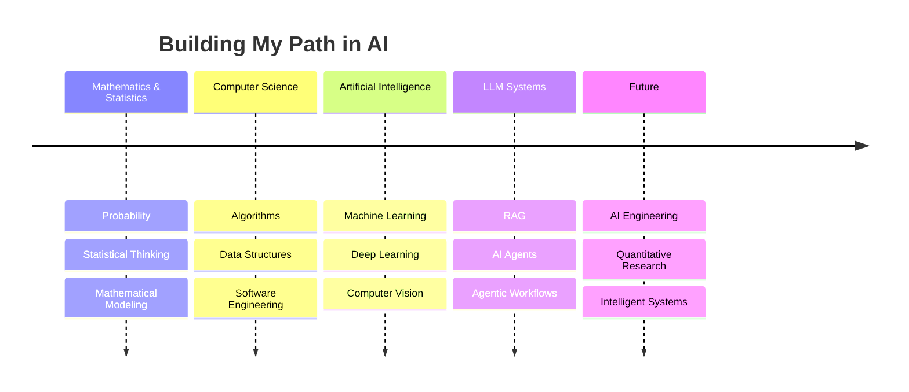

<!-- ========================================================= -->

<!--                    HERO SECTION                          -->

<!-- ========================================================= -->

<div align="center">


</div>

<div align="center">

# 👋 Hi, I'm Thanh Dat


<br/>

<a href="https://web-cv-rho-beryl.vercel.app/">

</a>

<a href="https://www.linkedin.com/in/%C4%91%E1%BA%A1t-tr%E1%BA%A7n-958337251/">

</a>

<a href="https://github.com/Dartrint">

</a>

</div>

<br/>

<!-- ========================================================= -->

<!--                    ABOUT ME                               -->

<!-- ========================================================= -->


## 🧠 About Me

```python
class AIEngineer:

    def __init__(self):
        self.name = "Trần Thành Đạt"
        self.background = [
            "Mathematics",
            "Computer Science"
        ]

        self.interests = [
            "Agentic AI",
            "LLM Applications",
            "Retrieval-Augmented Generation",
            "Machine Learning",
            "Computer Vision",
            "Intelligent Automation"
        ]

    def current_mission(self):
        return """
        Build intelligent systems
        where mathematics, data,
        and artificial intelligence meet.
        """

me = AIEngineer()

print(me.current_mission())
```

<br clear="right"/>

---

<!-- ========================================================= -->

<!--                    CURRENT FOCUS                          -->

<!-- ========================================================= -->

<div align="center">

## 🚀 Currently Exploring

</div>

<table align="center">
<tr>

<td width="33%" align="center">

### 🤖 Agentic AI

AI Agents
Multi-Agent Systems
LangGraph Workflows
LLM Orchestration

</td>

<td width="33%" align="center">

### 📈 Quant Research

Statistics
Financial Data
Time Series
Portfolio Analysis

</td>

<td width="33%" align="center">

### 📊 AI Research

Machine Learning
Computer Vision
Statistical Modeling
Data Mining

</td>

</tr>
</table>

---

<!-- ========================================================= -->

<!--                    TECH STACK                             -->

<!-- ========================================================= -->

<div align="center">

## 🛠️ My Tech Universe

</div>

### 👨‍💻 Languages

<p>


</p>

### 🤖 AI · Machine Learning

<p>


</p>

`LangChain`   `LangGraph`   `FAISS`   `Sentence Transformers`   `LLMs`

### ⚙️ Engineering

<p>


</p>

---

<!-- ========================================================= -->

<!--                    PROJECT JOURNEY                        -->

<!-- ========================================================= -->

<div align="center">

# ⭐ Featured Work

### Projects where I experiment, research and build.

</div>

<br/>

<table>
<tr>

<td width="50%">

### 🏥 Healthcare AI Systems

> Building intelligent healthcare assistants using LLMs and Retrieval-Augmented Generation.

**Highlights**

* RAG-based knowledge retrieval
* LLM orchestration
* Vector search with FAISS
* FastAPI backend
* Conversational AI
* Production-oriented architecture

<br/>

🔗 **Projects**

* [Healthcare Chatbot](https://github.com/Dartrint/Healthcare-chatbot)
* [Medical Chatbot](https://github.com/Dartrint/medical-chatbot)
* [BioMistral Chatbot](https://github.com/Dartrint/BioMistral_chatbot)

</td>

<td width="50%">

### 🤖 LLM & Intelligent Systems

> Exploring how Large Language Models can reason, retrieve information and interact with tools.

**Focus**

* Agent workflows
* Prompt engineering
* Knowledge retrieval
* LLM applications
* AI automation

<br/>

🔗 **Project**

[Explore GuppyLM →](https://github.com/Dartrint/GuppyLM)

</td>

</tr>

<tr>

<td width="50%">

### 👁️ Computer Vision

> Experimenting with deep learning for image understanding and transformation.

**Topics**

* Neural Style Transfer
* Image Processing
* Deep Learning
* Computer Vision

<br/>

🔗 **Project**

[Neutral Style Transfer →](https://github.com/Dartrint/Neutral_Style_Transfer)

</td>

<td width="50%">

### 📈 Mathematics × Data × AI

> Applying mathematical and computational thinking to real-world problems.

**Interests**

* Statistical Modeling
* Data Mining
* Machine Learning
* Quantitative Analysis
* Financial Data

<br/>

🔗 **Project**

[MA Crossover Strategy →](https://github.com/Dartrint/ma-crossover-strategy)

</td>

</tr>
</table>

---

<!-- ========================================================= -->

<!--                    SYSTEM ARCHITECTURE                    -->

<!-- ========================================================= -->

<div align="center">

## 🏗️ How I Think About AI Systems

</div>

```text
                    ┌─────────────────┐
                    │      DATA       │
                    └────────┬────────┘
                             │
                             ▼
                    ┌─────────────────┐
                    │  PROCESSING &   │
                    │   EMBEDDING     │
                    └────────┬────────┘
                             │
                             ▼
              ┌────────────────────────────┐
              │        AI SYSTEM           │
              │                            │
              │  ┌────────┐   ┌─────────┐  │
              │  │  RAG   │─▶│   LLM   │  │
              │  └────────┘   └────┬────┘  │
              │                    │       │
              │              ┌─────▼──┐    │
              │              │ AGENTS │    │
              │              └────┬───┘    │
              └───────────────────┼────────┘
                                  │
                                  ▼
                         ┌────────────────┐
                         │ INTELLIGENT    │
                         │    ACTION      │
                         └────────────────┘
```

---

<!-- ========================================================= -->

<!--                    GITHUB STATS                           -->

<!-- ========================================================= -->

<div align="center">

# 📊 GitHub Analytics


</div>

<br/>

<div align="center">


</div>

---

<!-- ========================================================= -->

<!--                    LEARNING JOURNEY                       -->

<!-- ========================================================= -->

<div align="center">

## 📚 My Learning Journey

</div>



---

<!-- ========================================================= -->

<!--                    CONTRIBUTION GRAPH                     -->

<!-- ========================================================= -->

<div align="center">

## 🐍 Contribution Journey


</div>

---

<!-- ========================================================= -->

<!--                    PHILOSOPHY                             -->

<!-- ========================================================= -->

<div align="center">

## ⚡ Philosophy

> **"Don't just use AI. Understand it, measure it, and build something useful with it."**

<br/>

```text
Research
   ↓
Experiment
   ↓
Build
   ↓
Measure
   ↓
Improve
   ↓
Repeat 🔁
```

</div>

---

<!-- ========================================================= -->

<!--                    CONTACT                                -->

<!-- ========================================================= -->

<div align="center">

## 🤝 Let's Connect

I'm interested in collaborating on:

🤖 **AI Systems** · 🧠 **Machine Learning** · 🔎 **RAG**
⚙️ **Agentic AI** · 📊 **Data Science** · 📈 **Quantitative Research**

<br/>

<a href="https://web-cv-rho-beryl.vercel.app/">

</a>

<a href="https://github.com/Dartrint">

</a>

</div>

<br/>

<div align="center">


### 🚀 Always learning. Always building.

</div>
